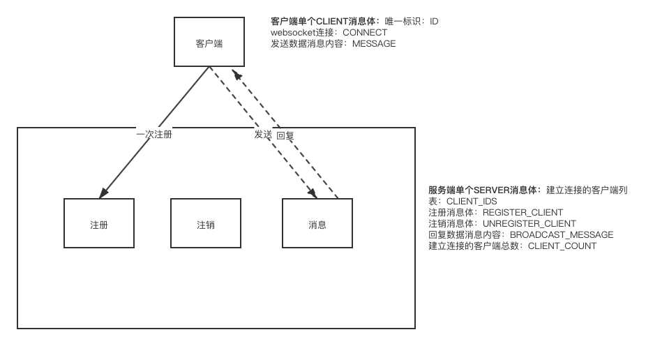
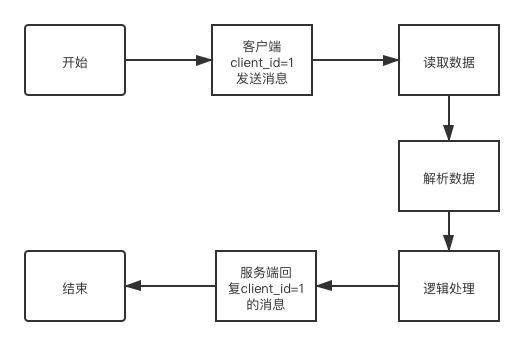

# 基于go-gin框架的web服务框架之websocket
项目地址：[https://github.com/Benny66/ginServer](https://github.com/Benny66/ginServer)

# websocket服务
使用webcocket通信相比于http，它可不像http那样是无状态的请求，http每一次数据的查询、处理都需要重新发起请求，进行三个握手，四次挥手，而websocket只需要进行一次tcp连接，就可以维持长连接不断的进行发送和回复消息的请求，并且支持服务端向客户端的实时消息推送，这一点是http无法做到的。

客户端发送一次请求，服务端保留住这个请求（注册），使用心跳维持互通，这就需要服务端维护一个接口去接受客户端的连接请求

```
// 客户端连接
func WsClient(context *gin.Context) {
	upGrande := websocket.Upgrader{
		//设置允许跨域
		CheckOrigin: func(r *http.Request) bool {
			return true
		},
		//设置请求协议
		Subprotocols: []string{context.GetHeader("Sec-WebSocket-Protocol")},
	}
	//创建连接
	conn, err := upGrande.Upgrade(context.Writer, context.Request, nil)
	if err != nil {
		log.WSLog(fmt.Sprintf("websocket connect error: %s", context.Param("channel")))
		format.NewResponseJson(context).Error(51001)
		return
	}
	//生成唯一标识client_id
	var uuid = uuid.NewV4().String()
	client := &ws.Client{
		Id:      uuid,
		Socket:  conn,
		Message: make(chan []byte, 1024),
	}
	//注册
	ws.WebsocketManager.RegisterClient(client)

	//起协程，实时接收和回复数据
	go client.Read()
	go client.Write()
}
```
上面是一个客户端连接的入口（接口），需要在router路由中进行配置
```
r.GET("/ws", api.WsClient)
```

客户端的连接地址则可以是：ws://127.0.0.1:8066/ws

 

 开启程序服务器后，后台开启一个协程去监听处理发送给客户端的消息，包括：客户端注册、客户端注销、回复客户端消息

 ```
 for {
		select {
		case client := <-manager.Register:
			//注册客户端
			manager.Lock.Lock()
			manager.Group[client.Id] = client
			manager.clientCount += 1
			log.WSLog(fmt.Sprintf("客户端注册: 客户端id为%s", client.Id))
			manager.Lock.Unlock()
		case client := <-manager.UnRegister:
			//注销客户端
			manager.Lock.Lock()
			if _, ok := manager.Group[client.Id]; ok {
				//关闭消息通道
				close(client.Message)
				//删除分组中客户
				delete(manager.Group, client.Id)
				//客户端数量减1
				manager.clientCount -= 1
				log.WSLog(fmt.Sprintf("客户端注销: 客户端id为%s", client.Id))
			}
			manager.Lock.Unlock()
		case data := <-manager.BroadCastMessage:
			//将数据广播给所有客户端
			for _, conn := range manager.Group {
				if data.IsBroadCast {
					conn.Message <- data.Message
				} else {
					if function.InSliceStr(conn.Id, data.ClientIDs) {
						conn.Message <- data.Message
					}
				}

			}

		}
	}
 ```

  


  ### 单个websocket的client结构体
  ```
type Client struct {
	Id      string
	Socket  *websocket.Conn
	Message chan []byte
}

  ```


  ### 服务端websocke的结构体
  ```
type Manager struct {
	//client.id => Client
	Group                map[string]*Client
	Lock                 sync.Mutex
	Register, UnRegister chan *Client
	BroadCastMessage     chan *BroadCastMessageData
	clientCount          uint //分组及客户端数量
}

  ```


  ### 回复数据消息结构体
  ```
type BroadCastMessageData struct {
	Message     []byte
	IsBroadCast bool
	ClientIDs   []string
}

  ```

  以下是在建立连接后的正常数据通信（发送数据，回复数据）的流程图

  

  在处理客户端消息的逻辑处理中，封装了一个handle文件，接收客户端请求指令的函数方法处理


  ```
  /**
 * Description: websocket服务器接收数据指令调用对应函数
 * author: 	shahao
 * create on:	2021-04-16 18:05:21
 */
func (manager *Manager) ServerCodeToFunc(data ReadData) {
	funcName := case2Camel(data.Actioncode)
	vft := manager.serverReturnFunc()
	params := make([]reflect.Value, 1)
	params[0] = reflect.ValueOf(data)
	if vft[funcName].IsValid() {
		vft[funcName].Call(params)
	}
}

  ```
  然后可以将处理逻辑集中放到serverInstructFunc处理，例如心跳回复函数

  ```
  //心跳包
func (m *ServerMethod) HeartBeat(params ReadData) {
	WebsocketManager.Success(params.Actioncode, true, params.IsBroadCast, params.ClientIDs)
}
  ```